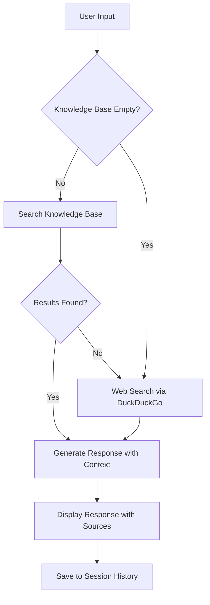

# Agentic RAG Agent

**Agentic RAG Agent** is a modern chat application that combines language models with retrieval-augmented generation using Agno's v2 Knowledge system. Users can ask questions based on custom knowledge bases, documents, and web data while maintaining chat history across sessions.

## Getting Started

### 1. Create a virtual environment

```shell
python3 -m venv .venv
source .venv/bin/activate
```

### 2. Install dependencies

```shell
pip install -r cookbook/examples/streamlit_apps/agentic_rag/requirements.in
```

### 3. Configure API Keys

Required:
```bash
export OPENAI_API_KEY=your_openai_key_here
```

Optional (for additional models):
```bash
export ANTHROPIC_API_KEY=your_anthropic_key_here
export GOOGLE_API_KEY=your_google_key_here
export GROQ_API_KEY=your_groq_key_here
```

### 4. Run PgVector

> Install [docker desktop](https://docs.docker.com/desktop/install/mac-install/) first.

- Run using a helper script

```shell
./cookbook/scripts/run_pgvector.sh
```

- OR run using the docker run command

```shell
docker run -d \
  -e POSTGRES_DB=ai \
  -e POSTGRES_USER=ai \
  -e POSTGRES_PASSWORD=ai \
  -e PGDATA=/var/lib/postgresql/data/pgdata \
  -v pgvolume:/var/lib/postgresql/data \
  -p 5532:5432 \
  --name pgvector \
  agnohq/pgvector:16
```

### 5. Run Agentic RAG App

```shell
streamlit run cookbook/examples/streamlit_apps/agentic_rag/app.py 
```

## Features

### New Knowledge System (v2)
- **Smart Content Loading**: Automatically handles PDFs, websites, CSV, and text files
- **Vector Search**: Semantic search with OpenAI embeddings
- **Persistent Storage**: PostgreSQL with pgvector for reliable document storage
- **Simple API**: Use `add_content()` method for easy document ingestion

### Model Support
The application supports multiple model providers:
- **OpenAI**: o3-mini, gpt-4o
- **Anthropic**: claude-3-5-sonnet
- **Google**: gemini-2.0-flash-exp  
- **Groq**: llama-3.3-70b-versatile

### Session Management
- **Auto-save**: Conversations are automatically saved
- **Session History**: Browse and resume previous conversations
- **Custom Names**: Rename sessions for better organization
- **Export**: Download chat history as markdown

## How to Use

1. **Open the App**: Navigate to [localhost:8501](http://localhost:8501) in your browser
2. **Add Documents**: Upload files or provide URLs to build your knowledge base
3. **Ask Questions**: Enter questions in the chat interface for context-aware answers
4. **General Queries**: The app can also answer questions using DuckDuckGo search without external documents

### Document Types Supported
- **PDFs**: Research papers, reports, manuals
- **Websites**: Articles, documentation, blogs  
- **CSV**: Data files with automatic parsing
- **Text Files**: Plain text documents

## Troubleshooting

- **Docker Connection Refused**: Ensure `pgvector` container is running (`docker ps`)
- **OpenAI API Errors**: Verify that `OPENAI_API_KEY` is set and valid
- **Import Errors**: Run `pip install -r requirements.in` to ensure all dependencies are installed
- **Database Issues**: Restart the pgvector container if you encounter connection problems

## Flow Diagram



The agent intelligently searches your knowledge base first, then falls back to web search when needed, ensuring comprehensive and accurate responses.

## Documentation

For more detailed information:
- [Agno Documentation](https://docs.agno.com)
- [Streamlit Documentation](https://docs.streamlit.io)

## Support

Need help? Join our [Discord community](https://agno.link/discord)


